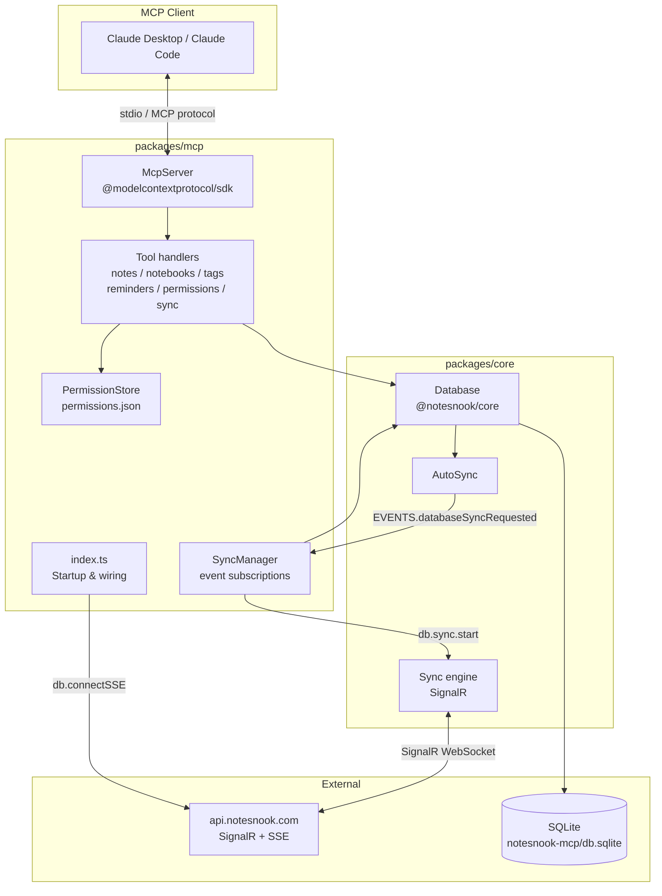
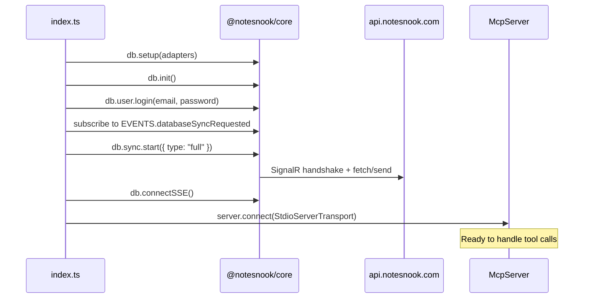

# Detailed Design — Notesnook MCP Server

## Overview

The Notesnook MCP Server is a new package (`packages/mcp/`) inside the Notesnook monorepo that exposes Notesnook notes, notebooks, tags, and reminders to AI agents via the Model Context Protocol (MCP). It runs as a local stdio process, authenticates against the Notesnook API using email/password credentials, maintains its own local SQLite database via `@notesnook/core`, and syncs bidirectionally using the existing sync infrastructure.

Access is controlled by a user-managed permission system: the AI can call permission tools to request access, the user approves, and the grants are persisted locally. By default, the AI has no access to any notes.

---

## Detailed Requirements

### Access & Permissions
- Full CRUD operations on notes, notebooks, tags, and reminders
- Deny by default — no data is accessible until explicitly granted
- Users grant access by notebook name, tag name, or note title (resolved to ID)
- Multiple grants covering the same note use **least-permissive wins** (intersection of permissions)
- The existing `note.readonly` flag is always enforced as a hard constraint regardless of grants
- When a note title is ambiguous (multiple matches), the server returns all matches with metadata for the user to disambiguate
- Permissions are persisted to a local JSON file across sessions

### Authentication & Database
- Authenticates via `NOTESNOOK_EMAIL` and `NOTESNOOK_PASSWORD` environment variables
- Maintains its own SQLite database (separate from the desktop app's DB)
- Database and permissions stored in `~/.notesnook-mcp/` by default (overridable via `NOTESNOOK_DATA_DIR`)

### Sync
- Full sync on startup
- Event-driven auto-sync: subscribes to `EVENTS.databaseSyncRequested` and calls `db.sync.start()` — same pattern as the web app
- `db.connectSSE()` for real-time push notifications from other devices
- `sync` tool available as a manual override

### Tool Surface
22 tools across 6 groups (tools-only; Resources and Prompts deferred to v2):

| Group | Tools |
|---|---|
| Notes | `list_notes`, `search_notes`, `get_note`, `create_note`, `update_note`, `delete_note` |
| Notebooks | `list_notebooks`, `create_notebook`, `delete_notebook`, `add_note_to_notebook`, `remove_note_from_notebook` |
| Tags | `list_tags`, `create_tag`, `tag_note`, `untag_note` |
| Reminders | `list_reminders`, `create_reminder`, `update_reminder`, `delete_reminder` |
| Permissions | `grant_access`, `revoke_access`, `list_permissions` |
| Sync | `sync` |

### Content Format
- Note content is read and written as **Markdown** using `db.notes.export(id, { format: "md" })`

### Transport
- stdio (for use with Claude Desktop, Claude Code, and other local MCP clients)

---

## Architecture Overview



### Startup sequence



---

## Components and Interfaces

### `src/index.ts` — Entry point

Responsible for:
1. Reading env vars (`NOTESNOOK_EMAIL`, `NOTESNOOK_PASSWORD`, `NOTESNOOK_DATA_DIR`)
2. Calling `setupDatabase()` and `db.init()`
3. Logging in via `db.user.login()`
4. Subscribing to `EVENTS.databaseSyncRequested` → calls `db.sync.start()`
5. Starting the initial full sync
6. Connecting SSE
7. Registering all tool handlers on the `McpServer`
8. Connecting `StdioServerTransport`

### `src/db.ts` — Database setup

Sets up the `@notesnook/core` `Database` instance with Node.js-appropriate adapters:

```ts
import DB from "@notesnook/core";
import { SqliteDialect } from "@streetwriters/kysely";
import BetterSQLite3 from "better-sqlite3-multiple-ciphers";
import * as betterTrigram from "sqlite-better-trigram";
import * as fts5Html from "sqlite3-fts5-html";
import { getLoadablePath } from "sqlite-regex";
import { NodeStorageInterface } from "./storage.js";

export function createDatabase(dataDir: string): DB {
  const dbPath = path.join(dataDir, "db.sqlite");
  const betterSqliteDb = BetterSQLite3(dbPath).unsafeMode(true);

  betterTrigram.load(betterSqliteDb);
  fts5Html.load(betterSqliteDb);
  betterSqliteDb.loadExtension(getLoadablePath());

  const db = new DB();
  db.setup({
    storage: new NodeStorageInterface(dataDir),
    eventsource: EventSource,
    fs: /* stub IFileStorage — attachments not supported in v1 */,
    compressor: async () => Compressor,
    sqliteOptions: {
      dialect: () => new SqliteDialect({ database: betterSqliteDb })
    }
  });
  return db;
}
```

### `src/storage.ts` — IStorage adapter

Implements the `IStorage` interface backed by a SQLite key-value table (same approach as desktop). Provides all required methods: `read`, `write`, `readMulti`, `writeMulti`, `remove`, `clear`, `getAllKeys`, plus all crypto methods delegated to `@notesnook/crypto`.

### `src/permissions.ts` — Permission store

Manages the grants file at `{dataDir}/permissions.json`.

```ts
type PermissionGrant = {
  id: string;               // uuid v4
  targetType: "notebook" | "tag" | "note";
  targetId: string;         // resolved Notesnook item ID
  targetName: string;       // human-readable, for display
  permissions: Array<"read" | "write" | "delete">;
  createdAt: number;        // unix ms
};

type PermissionsFile = {
  version: 1;
  grants: PermissionGrant[];
};
```

**Key methods:**

- `grant(targetType, targetId, targetName, permissions): PermissionGrant`
- `revoke(grantId): void`
- `list(): PermissionGrant[]`
- `checkAccess(note: Note, operation: "read"|"write"|"delete"): boolean`

**Permission check algorithm:**

```ts
checkAccess(note, operation):
  matchingGrants = grants.filter(g =>
    (g.targetType === "note"     && g.targetId === note.id) ||
    (g.targetType === "notebook" && noteIsInNotebook(note, g.targetId)) ||
    (g.targetType === "tag"      && noteHasTag(note, g.targetId))
  )
  if matchingGrants.length === 0: return false   // deny by default
  // least permissive wins = intersection
  return matchingGrants.every(g => g.permissions.includes(operation))
```

Note: `note.readonly === true` short-circuits any write/delete check to `false` regardless of grants.

### `src/tools/` — Tool handlers

One file per group. Each tool handler:
1. Validates parameters (Zod schema via MCP SDK)
2. Checks permissions via `PermissionStore`
3. Queries/mutates via `db.*` collection
4. Returns a structured MCP text response

#### `src/tools/notes.ts`

```ts
// list_notes
{ notebook?: string, tag?: string, favorite?: boolean,
  pinned?: boolean, archived?: boolean, limit?: number }

// search_notes
{ query: string, limit?: number }

// get_note — returns markdown content
{ id: string }

// create_note
{ title: string, content?: string, notebook?: string, tags?: string[] }

// update_note
{ id: string, title?: string, content?: string,
  pinned?: boolean, favorite?: boolean, archived?: boolean }

// delete_note — moves to trash
{ id: string }
```

#### `src/tools/notebooks.ts`

```ts
// list_notebooks — no params
// create_notebook
{ title: string, description?: string }
// delete_notebook
{ id: string }
// add_note_to_notebook
{ noteId: string, notebookId: string }
// remove_note_from_notebook
{ noteId: string, notebookId: string }
```

#### `src/tools/tags.ts`

```ts
// list_tags — no params
// create_tag
{ title: string }
// tag_note
{ noteId: string, tagId: string }
// untag_note
{ noteId: string, tagId: string }
```

#### `src/tools/reminders.ts`

```ts
// list_reminders — no params
// create_reminder
{ title: string, date: number, mode: "once"|"repeat"|"permanent",
  description?: string, priority?: "silent"|"vibrate"|"urgent",
  selectedDays?: number[] }
// update_reminder
{ id: string, title?: string, date?: number, mode?: string,
  description?: string, priority?: string, disabled?: boolean }
// delete_reminder
{ id: string }
```

#### `src/tools/permissions.ts`

```ts
// grant_access
{ targetType: "notebook"|"tag"|"note",
  targetName: string,
  permissions: Array<"read"|"write"|"delete"> }
// → resolves targetName to ID via db.lookup / db.notebooks / db.tags
// → if ambiguous (note), returns matches with metadata instead of granting

// revoke_access
{ grantId: string }

// list_permissions — no params
```

#### `src/tools/sync.ts`

```ts
// sync
{ type?: "full"|"send"|"fetch" }   // default: "full"
```

---

## Data Models

### PermissionGrant (MCP-server-specific)

```ts
type PermissionGrant = {
  id: string;
  targetType: "notebook" | "tag" | "note";
  targetId: string;
  targetName: string;
  permissions: Array<"read" | "write" | "delete">;
  createdAt: number;
};
```

### Note (from `@notesnook/core`)

Key fields relevant to the MCP server:

```ts
interface Note {
  id: string;
  title: string;
  headline?: string;
  pinned: boolean;
  favorite: boolean;
  readonly: boolean;
  archived?: boolean;
  localOnly: boolean;
  dateCreated: number;
  dateModified: number;
  dateEdited: number;
}
```

Content is stored separately; retrieved via `db.notes.export(id, { format: "md" })`.

### NoteAmbiguityResult (for disambiguation)

```ts
type NoteAmbiguityResult = {
  ambiguous: true;
  matches: Array<{
    id: string;
    title: string;
    notebooks: string[];   // notebook titles
    tags: string[];        // tag titles
    dateModified: number;
  }>;
};
```

---

## Error Handling

| Scenario | Behaviour |
|---|---|
| Auth failure on startup | Log error and exit with code 1; clear message about checking env vars |
| Sync failure (non-fatal) | Log warning; MCP server remains available; next auto-sync will retry |
| Tool call on inaccessible note | Return MCP error: `"Permission denied: note '{title}' requires {operation} access. Use grant_access to request it."` |
| Note not found | Return MCP error: `"Note not found: {id}"` |
| Ambiguous note title in `grant_access` | Return structured result with match list rather than an error; user picks |
| `note.readonly` write/delete attempt | Return MCP error: `"Note '{title}' is read-only."` |
| Vault-locked note content | Return MCP error: `"Note '{title}' is vault-locked. Vault access is not supported in v1."` |
| DB corruption / migration failure | Log error and exit; do not silently corrupt data |
| Network offline | Sync fails gracefully; local reads/writes continue; sync retries when `EVENTS.databaseSyncRequested` fires again |

All MCP tool errors are returned as MCP protocol errors (not thrown exceptions), so the AI can surface them to the user conversationally.

---

## Testing Strategy

### Unit tests — permission logic
- Grant/revoke/list operations
- `checkAccess` with: no grants (deny), single matching grant, multiple grants (intersection), `note.readonly` override
- Ambiguous title resolution returning matches vs. single match proceeding

### Integration tests — tool handlers
Using the existing `@notesnook/core` test infrastructure (`packages/core/__tests__/utils/`) with an in-memory SQLite database:

- Notes CRUD: create → get → update → delete; verify content round-trips as markdown
- Notebook management: create notebook, add note, list, remove note, delete notebook
- Tag management: create tag, apply to note, list, remove
- Reminder CRUD
- `search_notes`: full-text search returns correct results
- `list_notes` filters: by notebook, tag, favorite, pinned, archived
- Permission enforcement: tool calls blocked/allowed correctly based on grants
- Sync wiring: `EVENTS.databaseSyncRequested` subscription fires `db.sync.start()`

### Manual / smoke tests
- Full startup → login → sync → tool call flow against `api.notesnook.com`
- Claude Desktop config and tool discovery

---

## Appendices

### A. Technology Choices

| Technology | Choice | Rationale |
|---|---|---|
| MCP SDK | `@modelcontextprotocol/sdk` v1.x | Official TypeScript SDK; Zod schema validation |
| Transport | stdio | Standard for local MCP servers; no auth complexity |
| Database | `better-sqlite3-multiple-ciphers` + `@streetwriters/kysely` | Already in monorepo; used by desktop app and test suite |
| Core API | `@notesnook/core` | Single authoritative API for all Notesnook data; handles sync, crypto, collections |
| Schema validation | Zod | Already used throughout monorepo; SDK-native |
| Content format | Markdown (`db.notes.export`) | AI-friendly; natively supported by core |
| Packaging | `packages/mcp/` in monorepo | Co-located with core; self-contained PR; consistent with `packages/common` pattern |

### B. Key Research Findings

- `@notesnook/core` `Database` class is the single authoritative API; all apps use it
- Node.js initialization pattern is documented in `packages/core/__tests__/utils/index.ts` — the reference implementation for our `src/db.ts`
- Auto-sync is **event-driven**, not timer-based: `AutoSync` publishes `EVENTS.databaseSyncRequested` but the consuming app must subscribe and call `db.sync.start()` — the MCP server must wire this up explicitly (as `apps/web/src/stores/app-store.ts` does)
- The SignalR connection persists between syncs when auto-sync is enabled; `db.connectSSE()` provides a separate real-time push channel
- `db.notes.export(id, { format: "md" })` provides clean markdown output; all export formats: `"html"`, `"md"`, `"txt"`, `"md-frontmatter"`
- `db.lookup.notes(query)` supports full-text search with filter operators (`tag:`, `notebook:`, `is:favorite`, date ranges, etc.)
- Note content and note metadata are stored separately; content retrieved via `db.content.get(note.contentId)`

### C. Alternative Approaches Considered

| Decision | Alternative | Why Rejected |
|---|---|---|
| DB access | Direct access to desktop app's SQLite file | DB is encrypted with a separate key; concurrent writes risk corruption; undocumented |
| Auth | API token | Requires adding token generation UI to apps; deferred to v2 |
| Sync | Periodic timer | Not needed — the event system handles both push and pull directions |
| Sync | Sync before every read | Too slow; adds latency to every tool call |
| Permissions | Most permissive wins | Rejected in favour of least permissive — privacy-first design |
| Permissions | Explicit deny grants | Unnecessary complexity; deny-by-default with additive grants is sufficient and conflict-free |
| Packaging | Separate repository | Cross-repo versioning burden; harder to keep in sync with core changes |
| MCP primitives | Include Resources/Prompts | Resources don't add value over tools for a dynamic notes database; deferred to v2 |
