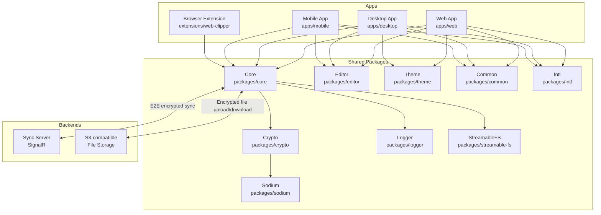
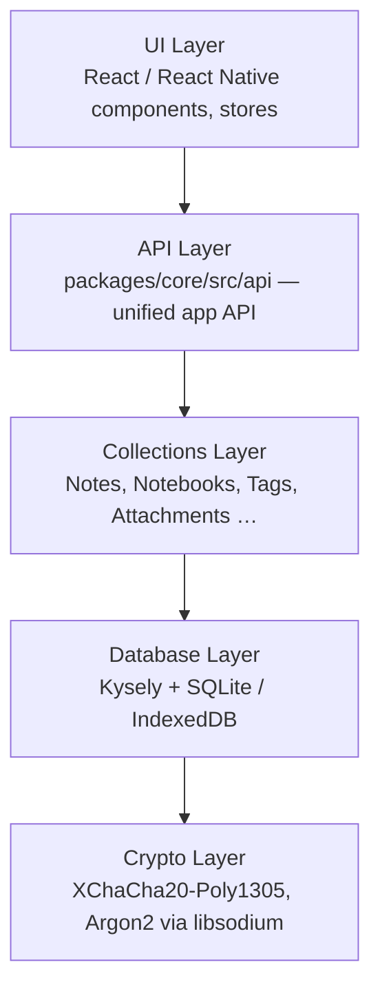

# Architecture

## High-level overview

Notesnook is a privacy-first, end-to-end-encrypted note-taking application distributed across web, desktop (Electron), and mobile (React Native) platforms. All platforms share a single core library; encryption is applied before data leaves the device.

## Layered architecture

## Design principles

- **Zero-knowledge / E2E encryption**: all data is encrypted on device before sync. The server never sees plaintext.
- **Platform-agnostic core**: `@notesnook/core` exposes a single `Database` class; platform adapters inject storage, crypto, and FS implementations via constructor arguments (dependency injection through accessor pattern).
- **SQL-first storage**: the core uses [Kysely](https://github.com/koskimas/kysely) (fork: `@streetwriters/kysely`) as a type-safe query builder over SQLite (Node/Electron) or IndexedDB-backed SQL (web/mobile).
- **Collection pattern**: each entity type (notes, notebooks, tags…) has a dedicated collection class under `packages/core/src/collections/`.
- **Event-driven communication**: `EventManager` (core utility) broadcasts domain events; UI stores subscribe to update state.
- **Optimistic sync**: items are modified locally first; the `Sync` subsystem reconciles with the server using a collector → merger pipeline over SignalR.

## Encryption scheme

- Symmetric: `XChaCha20-Poly1305` (via libsodium)
- Key derivation: `Argon2`
- Asymmetric: key pairs used for vault sharing / secure hand-off
- All encryption delegated to `IStorage.encrypt/decrypt` — platform implementations provide the actual libsodium binding (browser WASM vs Node native)
