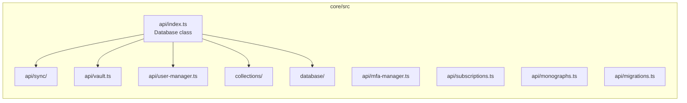

# Components

## packages/core

The heart of the application. Contains all business logic, storage, sync, and crypto orchestration.

### api/

| File | Role |
|---|---|
| `index.ts` | `Database` class — main entry point; wires all sub-systems |
| `sync/index.ts` | Sync orchestrator (SignalR, collector, merger, auto-sync) |
| `sync/collector.ts` | Gathers locally-modified items for upload |
| `sync/merger.ts` | Merges server items into the local database |
| `sync/devices.ts` | Multi-device management |
| `vault.ts` | Encrypted vault (separate note-level encryption) |
| `user-manager.ts` | Authentication: login, logout, token refresh |
| `token-manager.ts` | JWT / OAuth token lifecycle |
| `mfa-manager.ts` | Multi-factor authentication |
| `subscriptions.ts` | Pro subscription status |
| `monographs.ts` | Public note publishing |
| `migrations.ts` | Database schema migration runner |
| `key-manager.ts` | Encryption key generation and storage |

### collections/

Each file exports a class for a specific entity type. All collections extend `Collection` and expose typed query methods.

| File | Entity |
|---|---|
| `notes.ts` | Notes |
| `notebooks.ts` | Notebooks |
| `tags.ts` | Tags |
| `colors.ts` | Colors |
| `attachments.ts` | File attachments |
| `content.ts` | Rich-text content (Tiptap JSON) |
| `note-history.ts` | Per-note revision history |
| `reminders.ts` | Scheduled reminders |
| `relations.ts` | Relations between entities |
| `vaults.ts` | Vault metadata |
| `monographs.ts` | Published monographs |
| `shortcuts.ts` | Navigation shortcuts |
| `trash.ts` | Trash (soft-delete) |
| `settings.ts` / `legacy-settings.ts` | User preferences |

### database/

| File | Role |
|---|---|
| `index.ts` | Kysely DB setup, plugin system, dialect abstraction |
| `sql-collection.ts` | Base class for SQL-backed collections |
| `backup.ts` | Export/import backup logic |
| `fs.ts` | `IFileStorage` interface + file download helpers |
| `fts.ts` | Full-text search indexing |
| `kv.ts` | Key-value storage abstraction |
| `config.ts` | Config storage abstraction |
| `migrations.ts` | SQL schema migration definitions |

---

## packages/crypto

Thin wrapper over `@notesnook/sodium` exposing high-level operations.

| File | Role |
|---|---|
| `encryption.ts` | `XChaCha20-Poly1305` encrypt |
| `decryption.ts` | Decrypt |
| `keyutils.ts` | Key serialisation helpers |
| `password.ts` | `Argon2` password hashing |
| `interfaces.ts` | `INNCrypto` interface |

---

## packages/sodium

Platform-aware libsodium binding. Uses browser WASM build for web/mobile, native Node.js build for desktop/server. Exports a common `ISodium` interface.

---

## packages/editor

Rich-text editor built on **Tiptap 2** (ProseMirror). Exports a fully self-contained `Editor` React component.

Key areas:

- `extensions/` — 30+ custom Tiptap extensions (math, callouts, embed, check-list, outline-list, attachments, etc.)
- `toolbar/` — dynamic toolbar with tool definitions, floating menus, and popups
- `hooks/` — editor lifecycle and feature hooks
- `components/` — React wrappers

---

## packages/editor-mobile

Thin React wrapper that bundles `@notesnook/editor` into a web-view-compatible entry point for the React Native mobile app.

---

## packages/common

Shared React hooks, UI utilities, and the singleton `database` instance (`new Database()`). Used by both web and desktop apps.

---

## packages/theme

Theme engine built on `@emotion/react` and Theme UI. Provides `ScopedThemeProvider` and design tokens (colors, typography, spacing).

---

## packages/intl

Internationalisation using **LinguiJS**. Contains compiled message catalogs and helper types.

---

## packages/streamable-fs

Streaming wrapper over IndexedDB-based virtual filesystem. Used by the web and mobile apps for chunked attachment encryption/decryption.

---

## apps/web

React SPA (`Vite`). Layout: three-pane (navigation, list, editor) with responsive mobile collapse.

Key directories:

| Dir | Role |
|---|---|
| `stores/` | Zustand stores (note, notebook, editor, settings, user, theme, …) |
| `components/` | Reusable UI components |
| `navigation/` | Hash-router based navigation |
| `screens/` | Top-level route screens |
| `dialogs/` | Modal dialogs |
| `hooks/` | Custom React hooks |
| `common/` | App-level events, constants, DB helpers |

---

## apps/desktop

Electron wrapper around the web app. Main process (`src/main.ts`) creates the `BrowserWindow` and handles:

- IPC via `electron-trpc`
- Auto-updater
- System tray, jump lists, native menus
- Custom DNS, protocol handler (`notesnook://`)
- Desktop integration (startup launch, etc.)

---

## apps/mobile

React Native application (iOS + Android). Detox for E2E tests.

Key directories:

| Dir | Role |
|---|---|
| `screens/` | Navigation screens |
| `stores/` | State management |
| `services/` | Background services |
| `components/` | Mobile-specific UI |
| `share/` | Share extension entry point |

---

## apps/monograph

Next.js / Node server for rendering publicly-published monographs. Standalone deployment (Dockerfile included).

---

## apps/vericrypt

Vite+React standalone web app for verifying Notesnook's encryption claims. Self-contained.

---

## extensions/web-clipper

Browser extension (Chrome/Firefox). Uses `@notesnook/clipper` for DOM serialisation; communicates with the Notesnook web app via message relay.

---

## servers/themes

Themes distribution server.
