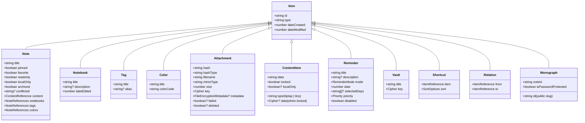

# Data Models

All types are defined in `packages/core/src/types.ts` and `packages/core/src/database/index.ts`.

## Entity hierarchy



## Deleted / soft-delete model

Every item can be wrapped in `MaybeDeletedItem<T>`:

```ts
type MaybeDeletedItem<T> = T | DeletedItem;
type DeletedItem = { id: string; deleted: true; dateModified: number; synced: boolean };
```

Trash items additionally carry `TrashItem` metadata (type, `dateDeleted`, `deletedBy`).

## Sort & Group options

```ts
type SortOptions = {
  sortBy: "dateCreated" | "dateDeleted" | "dateEdited" | "dateModified"
        | "title" | "filename" | "size" | "dateUploaded" | "dueDate" | "relevance";
  sortDirection: "desc" | "asc";
};

type GroupOptions = SortOptions & {
  groupBy: "none" | "abc" | "year" | "month" | "week" | "default";
};
```

Grouping keys identify which view the option applies to:

```ts
type GroupingKey = "home" | "notes" | "notebooks" | "tags" | "trash"
                 | "favorites" | "reminders" | "archive" | "search";
```

## Collection type map

```ts
type Collections = {
  notes: "note" | "trash";
  notebooks: "notebook" | "trash";
  attachments: "attachment";
  reminders: "reminder";
  relations: "relation";
  content: "tiptap" | "tiny";
  shortcuts: "shortcut";
  tags: "tag";
  colors: "color";
  ...
};
```

## Cipher / encryption types (packages/crypto/src/types.ts)

```ts
type Cipher<TFormat extends DataFormat> = {
  iv: string;
  salt: string;
  alg: string;
  cipher: TFormat extends "base64" ? string : Uint8Array;
};

type SerializedKey = { password: string; salt: string } | { key: string; salt: string };
```

## File encryption metadata

```ts
type FileEncryptionMetadata = {
  chunkSize: number;
  iv: string;
  size: number;
  salt: string;
  alg: string;
};
```

## Settings model

`SettingItem` is a generic KV entry in the settings collection. Well-known keys include display preferences (font, date/time format, theme), desktop integration settings, and toolbar configuration.

## Backup file format

```ts
type BackupFile = {
  version: number;         // CURRENT_DATABASE_VERSION
  type: "web" | "mobile" | "node";
  date: number;
  // data: array of items + string[] (key chunks)
};
```
