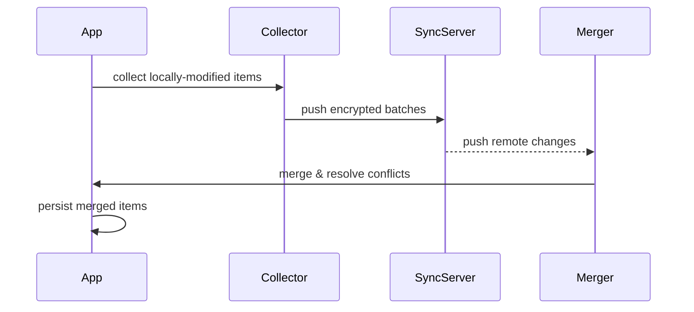

# Interfaces & APIs

## Core platform adapter interfaces

The `Database` constructor accepts platform-specific implementations of these interfaces (defined in `packages/core/src/interfaces.ts`):

### `IStorage`

Key-value + encrypted storage. Implementations must provide:

```
read / write / readMulti / writeMulti / remove / removeMulti / clear / getAllKeys
encrypt / encryptMulti / decrypt / decryptMulti / decryptAsymmetric
deriveCryptoKey / getCryptoKey / generateCryptoKey / generateCryptoKeyPair
hash (Argon2)
```

### `IFileStorage`

Streaming encrypted file storage for attachments:

```
write(filename, data, chunkSize) → hash
read(filename, chunkSize) → stream
delete(filename)
exists(filename) → boolean
hashStream(stream) → hash
```

### `ICompressor`

Compress/decompress for backup & sync payloads.

### `KVStorage` / `ConfigStorage`

Simpler typed stores for application config and runtime KV data.

---

## `@notesnook/core` — public API surface

The single export is the `Database` class (`packages/core/src/api/index.ts`). Consumers use it like:

```ts
import { Database } from "@notesnook/core";
const db = new Database();
await db.init();
```

Key namespaces on `Database`:

| Property | Type | Description |
|---|---|---|
| `db.notes` | `Notes` | CRUD + query for notes |
| `db.notebooks` | `Notebooks` | CRUD + query for notebooks |
| `db.tags` | `Tags` | Tag management |
| `db.colors` | `Colors` | Color labels |
| `db.attachments` | `Attachments` | File attachments |
| `db.content` | `Content` | Rich-text content blobs |
| `db.noteHistory` | `NoteHistory` | Revision snapshots |
| `db.reminders` | `Reminders` | Scheduled reminders |
| `db.relations` | `Relations` | Cross-entity relationships |
| `db.vaults` | `Vaults` | Encrypted vault management |
| `db.shortcuts` | `Shortcuts` | Navigation shortcuts |
| `db.trash` | `Trash` | Soft-deleted items |
| `db.settings` | `Settings` | User preferences |
| `db.monographs` | `MonographsCollection` | Published notes |
| `db.lookup` | `Lookup` | Full-text search |
| `db.backup` | `Backup` | Export/import |
| `db.migrations` | `Migrations` | Schema migration runner |
| `db.vault` | `Vault` | Vault API |
| `db.user` | `UserManager` | Auth |
| `db.mfa` | `MFAManager` | Two-factor auth |
| `db.subscriptions` | `Subscriptions` | Pro plan |
| `db.sync` | `Sync` | Sync engine |
| `db.eventManager` | `EventManager` | Domain events |
| `db.fs` | `FileStorage` | File upload/download |

---

## Sync protocol

Transport: **Microsoft SignalR** (WebSockets with fallback).

Flow:



Key types (`packages/core/src/api/sync/types.ts`):

- `SyncInboxItem` — item received from server
- `SyncTransferItem` — item sent to server
- `SyncableItemType` — entity types that participate in sync
- `SYNC_COLLECTIONS_MAP` — maps collection name → item type

---

## Desktop IPC (electron-trpc)

The Electron main process exposes a tRPC `router` via `createIPCHandler`. The web renderer calls procedures via a tRPC client injected through `preload.ts`.

Router is defined in `apps/desktop/src/api/`.

---

## `@notesnook/crypto` — public API

```ts
class NNCrypto implements INNCrypto {
  encrypt(key, plainText, outputFormat)
  decrypt(key, cipherData, outputFormat)
  encryptMulti(key, items)
  decryptMulti(key, items)
  hash(password, email)          // Argon2
  generateKey(password, salt)
  generateKeyPair()
}
```

---

## Web Extension messaging

`extensions/web-clipper/src/api.ts` — extension background script communicates with the Notesnook web app via a relay (`apps/web/src/utils/web-extension-relay.ts`) using `window.postMessage` / browser extension messaging APIs.

---

## Theme API

`packages/theme` exports `ScopedThemeProvider` which wraps children in an Emotion theme context. Consumers can switch themes dynamically; the theme object follows the `Theme UI` spec with Notesnook-specific extension tokens.

---

## i18n API (`@notesnook/intl`)

Uses LinguiJS macros. Components use `<Trans>` or the `t` tag template. The `intl` package exports compiled catalogs loaded at runtime.
