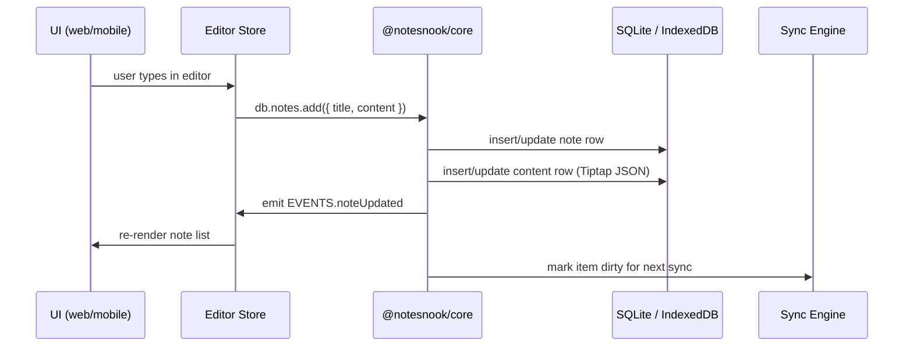
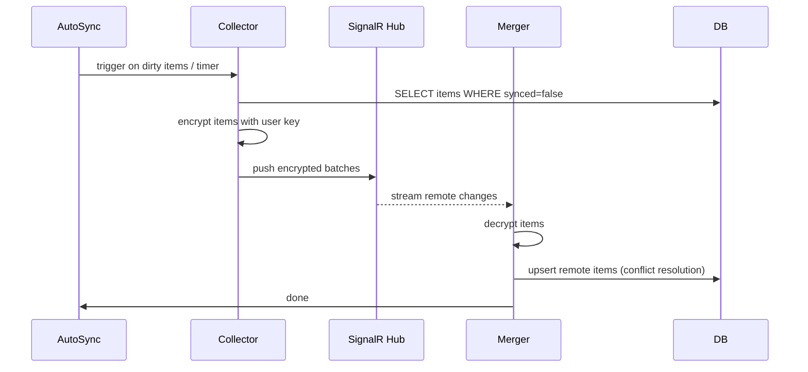
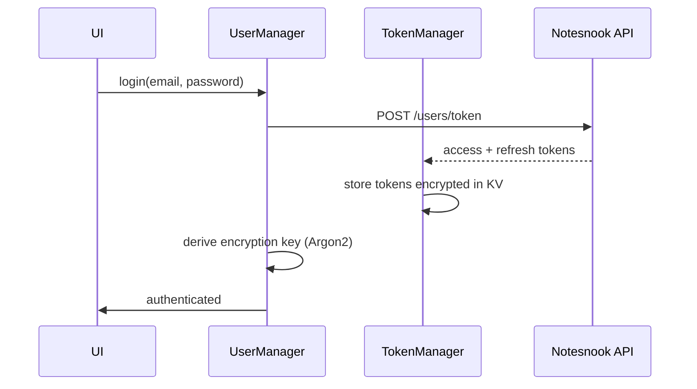
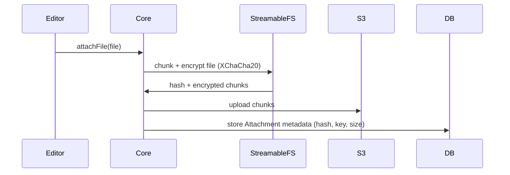
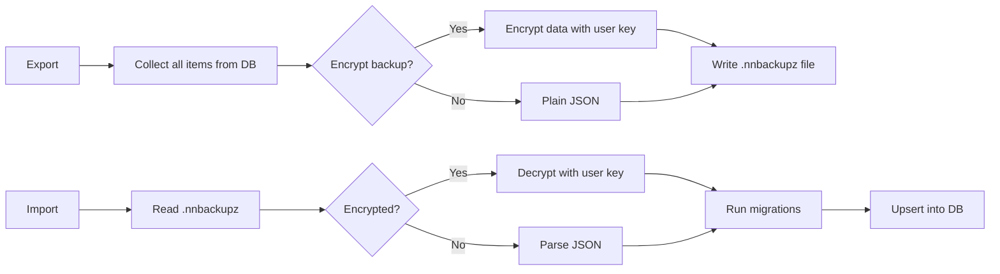

# Workflows

## Note creation & editing

## Sync cycle

Conflict resolution strategy: last-write-wins by `dateModified`; conflicted notes are surfaced to the user for manual review.

## Authentication flow

Token refresh is handled transparently by `TokenManager`; expired access tokens are refreshed using the stored refresh token.

## Attachment upload

Download reverses the flow: chunks are fetched from S3, decrypted, and streamed to the consumer.

## Backup & restore

## Monograph publishing

1. User picks a note and clicks "Publish".
2. Core generates a public slug and optionally encrypts with a reader password.
3. Metadata is pushed to the Notesnook sync server.
4. `apps/monograph` Next.js server fetches the encrypted content and renders it, decrypting client-side when a password is provided.

## Build & release pipeline

| Target | Trigger | Workflow file |
|---|---|---|
| Web | push to release branch | `web.publish.yml` |
| Desktop | push to release branch | `desktop.publish.yml` |
| iOS | push to release branch | `ios.publish.yml` |
| Android | push to release branch | `android.publish.yml` |
| Monograph | push | `monograph.publish.yml` |
| Preview (web) | PR | `web.preview.yml` |
| Preview (desktop) | PR | `desktop.preview.yml` |
| Preview (Android) | PR | `android.preview.firebase.yml` |
| Tests (core) | push / PR | `core.tests.yml` |
| Tests (web) | push / PR | `web.tests.yml` |

### Local development commands (via `npm run tx`)

| Command | What it does |
|---|---|
| `npm run bootstrap` | Install deps, link workspaces |
| `npm run start:web` | Dev server for web app |
| `npm run start:desktop` | Electron dev mode |
| `npm run start:android` | React Native Metro + Android |
| `npm run start:ios` | React Native Metro + iOS |
| `npm run test:core` | Core unit tests |
| `npm run test:web` | Web integration tests |
| `npm run build` | Build all (except mobile/web/monograph) |
| `npm run prettier` | Format all code |
| `npm run lint` | ESLint across apps + packages |

## Vault workflow

The vault is an additional layer of per-note encryption using a user-defined password separate from the account password.

1. User creates a vault with a password → `db.vault.create(password)`.
2. Core generates a vault key, encrypts it with the vault password, and stores the cipher in the `vaults` collection.
3. Locking a note encrypts its content with the vault key.
4. Unlocking requires the vault password; the vault key is held in memory for the session duration.
