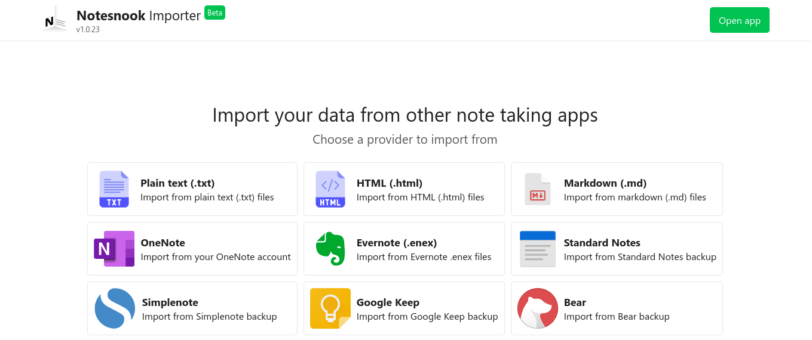

!!!info Notesnook importer is in Beta
If you face any problem while importing notes from other note apps, please report the on our [github](https://github.com/streetwriters/notesnook/issues) and tell us on our [Discord](https://discord.com/invite/5davZnhw3V)
!!!

Notesnook importer is your one stop location to import notes from any notes app other there. We have added support for most of the popular note apps.

## Try it out
You can try out the importer by going to [https://importer.notesnook.com](https://importer.notesnook.com)

## Supported note apps and formats

1. Plain text files
2. HTML files
3. Markdown (.md) files
4. OneNote
5. EverNote
6. Standard Notes
7. Simplenote
8. Google Keep
9. Bear notes
10. Joplin

Don't see your notes app? No worries, create an issue on [github](https://github.com/streetwriters/notesnook/issues)
