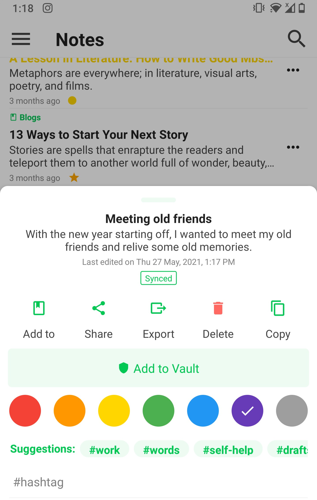
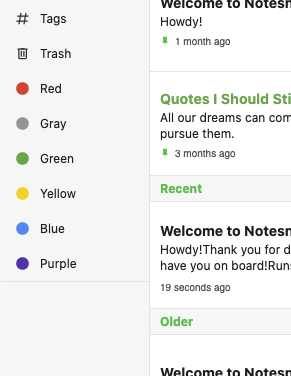

# Colors

Colors are a simple and fast way to organize your notes.

## How to assign color to note

||| Desktop/Web
1. Click on the `three dot more` button or right click on a note.
2. Select the desired color from the properties menu.

3. That's it!
||| Mobile/Tablet
1. Press the `three-dot more` button on right side on note.

2. Select the desired color from the Bottom Sheet Menu.

3. That's it
   |||

## Color Shortcuts

A shortcut to notes of specific color appears on Side Menu. The shortcut will appear when there is alteast one note in a color.

